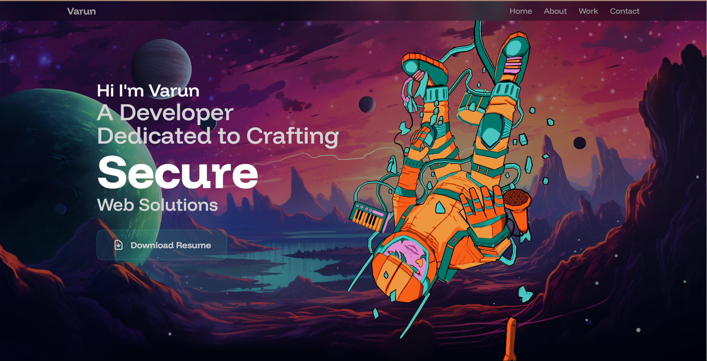

# 🚀 My Portfolio

A modern, responsive portfolio website built with React, Vite, and TailwindCSS featuring 3D animations, interactive components, and a sleek dark theme.

## 🌟 Live Demo

**[View Live Portfolio](https://my-portfolio-2rggjgbh8-varun-kumar-singhs-projects-3f9d06df.vercel.app)**

## 📸 Preview



## ✨ Features

- **🎨 Modern Design**: Dark theme with custom color palette and gradients
- **📱 Fully Responsive**: Optimized for all devices and screen sizes
- **🌍 3D Graphics**: Interactive 3D elements using Three.js and React Three Fiber
- **⚡ Smooth Animations**: Framer Motion animations and GSAP integration
- **🎯 Interactive Components**: Hover effects, parallax backgrounds, and orbiting elements
- **📧 Contact Form**: Functional contact form with EmailJS integration
- **📄 Resume Download**: Direct resume download functionality
- **🔧 Tech Stack Display**: Dynamic logos and skills showcase

## 🛠️ Tech Stack

### Frontend
- **React 19** - Latest React with new features
- **Vite** - Fast build tool and development server
- **TailwindCSS v4** - Latest utility-first CSS framework

### 3D & Animations
- **Three.js** - 3D graphics library
- **React Three Fiber** - React renderer for Three.js
- **React Three Drei** - Useful helpers for React Three Fiber
- **Framer Motion** - Advanced animation library
- **GSAP** - Professional animation toolkit

### UI & UX
- **React Responsive** - Responsive design utilities
- **Cobe** - Interactive globe component
- **EmailJS** - Email service integration

### Development Tools
- **ESLint** - Code linting and formatting
- **Vercel** - Deployment and hosting

## 🚀 Getting Started

### Prerequisites
- Node.js (v18 or higher)
- npm or yarn

### Installation

1. **Clone the repository**
   ```bash
   git clone https://github.com/varunkm11/My-Portfolio.git
   cd My-Portfolio
   ```

2. **Install dependencies**
   ```bash
   npm install
   ```

3. **Start development server**
   ```bash
   npm run dev
   ```

4. **Open your browser**
   Navigate to `http://localhost:5174`

## 📝 Available Scripts

```bash
# Start development server
npm run dev

# Build for production
npm run build

# Preview production build
npm run preview

# Lint code
npm run lint
```

## 🎨 Custom Features

### Color Palette
- **Primary**: `#030412` - Deep navy background
- **Storm**: `#282b4b` - Card backgrounds
- **Royal**: `#5c33cc` - Accent colors
- **Aqua**: `#33c2cc` - Highlights

### Animations
- **Orbital Motion**: Custom CSS animations for floating elements
- **Marquee Effects**: Smooth scrolling text animations
- **Hover Interactions**: Subtle transform effects on UI elements

### 3D Components
- **Astronaut Model**: Interactive 3D character
- **Globe**: Rotating interactive globe
- **Parallax Background**: Dynamic background effects

## 📁 Project Structure

```
src/
├── components/          # Reusable UI components
│   ├── Alert.jsx
│   ├── Astronaut.jsx
│   ├── Globe.jsx
│   └── ...
├── sections/           # Main page sections
│   ├── Hero.jsx
│   ├── About.jsx
│   ├── Projects.jsx
│   └── ...
├── constants/          # App constants and data
└── index.css          # Global styles and Tailwind config
```

## 🌐 Deployment

The portfolio is automatically deployed to Vercel with every push to the main branch.

### Manual Deployment
```bash
# Deploy to production
vercel --prod
```

## 🔧 Configuration

### Environment Variables
Create a `.env.local` file for local development:
```env
VITE_EMAILJS_SERVICE_ID=your_service_id
VITE_EMAILJS_TEMPLATE_ID=your_template_id
VITE_EMAILJS_PUBLIC_KEY=your_public_key
```

### Tailwind Configuration
Custom colors, animations, and utilities are defined in `tailwind.config.js`:
```javascript
theme: {
  extend: {
    colors: {
      primary: '#030412',
      storm: '#282b4b',
      royal: '#5c33cc',
      // ... more colors
    }
  }
}
```

## 📱 Responsive Design

- **Mobile First**: Optimized for mobile devices
- **Tablet Support**: Adapted layouts for tablets
- **Desktop Enhanced**: Full-featured desktop experience
- **4K Ready**: Scales beautifully on high-resolution displays

## 🎯 Key Sections

1. **Hero**: 3D astronaut with animated text
2. **About**: Interactive grid with tech stack
3. **Projects**: Showcase of development work
4. **Experience**: Professional timeline
5. **Contact**: Functional contact form

## 🤝 Contributing

1. Fork the repository
2. Create a feature branch: `git checkout -b feature/amazing-feature`
3. Commit changes: `git commit -m 'Add amazing feature'`
4. Push to branch: `git push origin feature/amazing-feature`
5. Open a Pull Request

## 📄 License

This project is licensed under the MIT License - see the [LICENSE](LICENSE) file for details.

## 📞 Contact

**Varun Kumar Singh**
- Linke: [@Varun Kumar Singh](https://www.linkedin.com/in/varun-kumar-singh-267951269/)
- GitHub: [@varunkm11](https://github.com/varunkm11)

## 🙏 Acknowledgments
- [Three.js](https://threejs.org/) for 3D graphics
- [Framer Motion](https://www.framer.com/motion/) for animations
- [TailwindCSS](https://tailwindcss.com/) for styling
- [Vercel](https://vercel.com/) for hosting

---

⭐ **Star this repository if you found it helpful!**